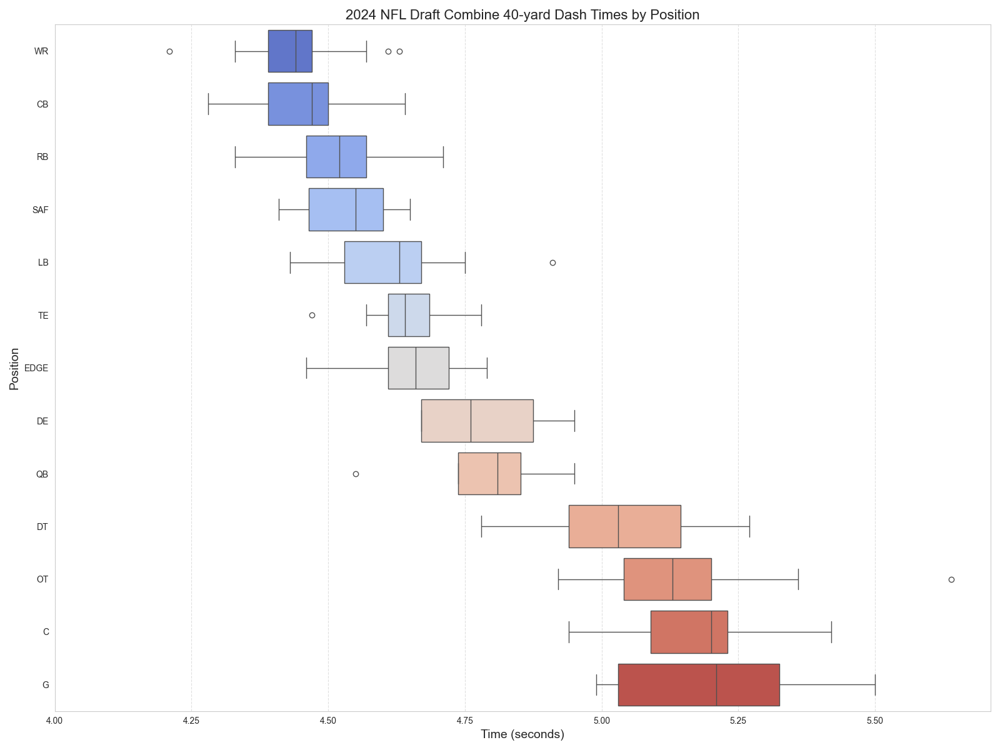

# Welcome to Matthew Dennahower's Portfolio

## About me

Welcome to my data science portfolio! My name is Matthew Dennahower, and I am dedicated to leveraging data to uncover insights and drive strategic decision-making. I hold a Bachelor of Science and a Master of Arts in Economics, equipping me with a robust foundation in analytical thinking and quantitative analysis.

My professional journey spans over 7 years in the financial services industry, where I have honed my expertise in mortgage underwriting and processing. Additionally, I have a proven track record of developing comprehensive reports and uncovering actionable insights to support various departments, streamline processes, and enhance operational efficiency.

My interests lie in the dynamic and ever-evolving fields of sports analytics, economics, and financial market dynamics. Through this portfolio, I aim to showcase my projects and demonstrate how data can be harnessed to solve complex problems and reveal hidden patterns.

I invite you to explore my work and join me on this journey of discovery and innovation. Together, we can unlock the potential of data to drive impactful results.

## Visualizations

## Current projects
1/ [WNBA Player Correlation](wnba_player_correlation/readme.md) : 
Data science project analyzing intra-team player correlation in the WNBA

2/ [Web Scraping EPL Player Game Data](epl_web_scraping/readme.md) :
Web scraping, preprocessing, cleaning, and exporting English Premier League player game data

3/ [NBA Player Triple Poisson Model](nba_triple_poisson/readme.md) :
Data science project analyzing the number of points and three point shots made by NBA players in a given game using a triple Poisson model

## Previous projects
Projects are sorted from most recent to oldest.

