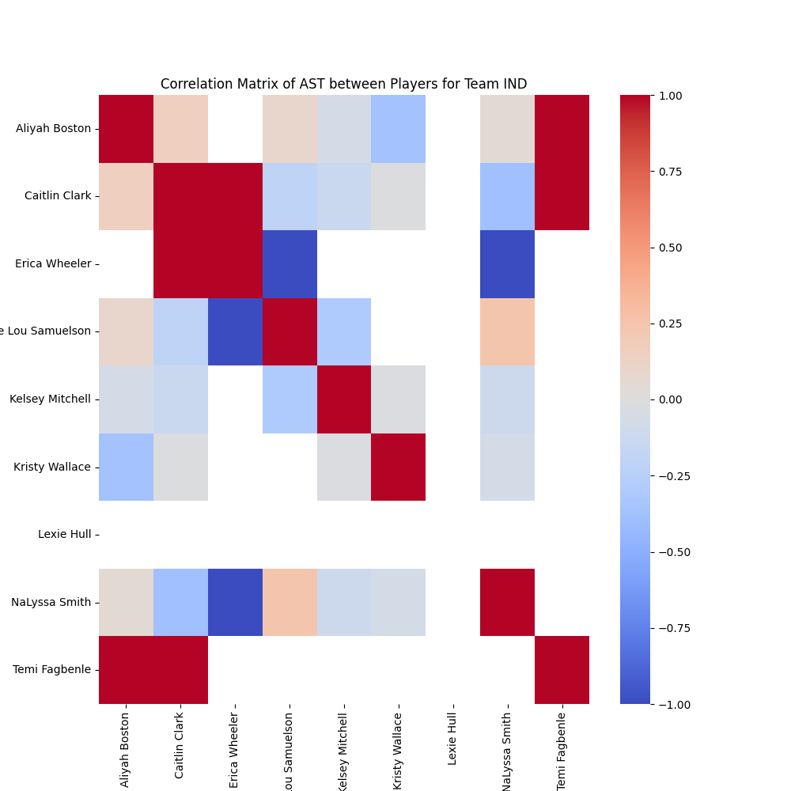

## Objective

This project focuses on analyzing the correlation between starting players on the same team in the WNBA league, specifically for the 2024 season. The data was sourced from a publicly accessible reference site, formatted into a .csv file, and then analyzed using pandas and seaborn to create a correlation matrix for each team.
 

 

 [![](https://img.shields.io/badge/pandas-white?logo=data:image/png;base64,iVBORw0KGgoAAAANSUhEUgAAAMIAAAEDCAMAAABQ/CumAAAAeFBMVEX///8TB1QAAEb/ygDnBIgPAFLNzNYTAFnQ0NgMAFcAAETb2eP39/oUBlfV1N7/xwDmAID/9tfLydcjG17/4Yz//vbCwM3ykcL61OfoBIwyKmgAADYAAE0AAErx8PTIxdT/+un/34T85/Lyir/lAHv50eX+9fkpH2Ma8J+4AAACEklEQVR4nO3dzVIaQRSAUYNCEIGoiYmJivnP+79hFrmLVHELZ6pnmG483xqaPruh5lb32ZkkSZIkSZIkvb52z7dZU2+rT4uH2X6rx6m31afF7M1+87dTb6tPCDWEUEMINYRQQ5MS1tu0nqtMSrhKn26e1v1WmZawyn58g4DQL4QIoSyECKEshAihLIQIoSyECKEshAihLIQIoSyECKEshAihLIQIoSyECOFA6cvM5a4nYb29yjoO4WmVvM58WPQkbF8e+RqPcDlPVp4t+xLS/W0QEBCqI8yTLpsizN8n/WmJ0CEEBAQEBAQEBIT2CF+/fci6a4hw8y7rvC3CeRYCAgICAgICAgICAgICwlCEtJYIdzdp/3+kdkKHToFQ+RjJMCEcCKF7CAdC6B7CgRC6Nylh9zGtJUJ6uNCsnsOFhhkvPAHC9x+fsloi/Pp5nXTREuH++iLpMwICAgICAgICAgICAgKC/87R7/u0lggdQkBAQEBAQEB4dYQON67UTqh9KuwkDlRBQED4R8gOF5o3Rdh8yepLGO0ez6MNPO+WQ9w3NilhvBAihLIQIoSyECKEshAihLIQIoSyECKEshAihLIQIoSyECKEshAihLIQIoSyEKJt+lL0SNeADUR4TG9cGWXHew10AkPP4aRBO9ohEuOFUEMINYRQQwg1dAKEDvd41t5t2u7lL0qSJEmSJEnSyfUXeomSFq0EzbkAAAAASUVORK5CYII=)](#)

Skills developed: Python (pandas - dataframes, seaborn - visualizations), Web Scraping

Link : [wnba_player_correlation](https://github.com/MattDennahower/mattdennahower.github.io/tree/main/docs/wnba_player_correlation)

----
#### Project Board

2024-08-06 : 

- Creation of readme
- Add image of projects and packages

----
#### Future work

1. Develop a simulation to enhance reliability using a Bayesian model.

2. Extend the principles to other leagues and shift the focus to analyzing correlations based on player positions rather than individual players on the same team.